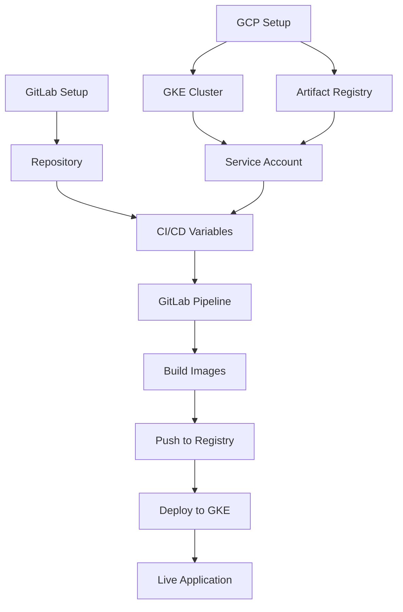

# Complete GitLab Setup & CI/CD Integration Guide

> **Your complete end-to-end guide** for deploying the flask-k8s-app on Google Kubernetes Engine (GKE) with automated GitLab CI/CD pipelines.

## 📋 Table of Contents

1. [Overview](#overview)
2. [Prerequisites](#prerequisites)
3. [Quick Start Checklist](#quick-start-checklist)
4. [Part 1: GCP Setup](#part-1-gcp-setup)
5. [Part 2: GitLab Repository Setup](#part-2-gitlab-repository-setup)
6. [Part 3: Service Account Configuration](#part-3-service-account-configuration)
7. [Part 4: GitLab CI/CD Variables](#part-4-gitlab-cicd-variables)
8. [Part 5: First Deployment](#part-5-first-deployment)
9. [Part 6: Understanding the Pipeline](#part-6-understanding-the-pipeline)
10. [Part 7: Making Updates](#part-7-making-updates)
11. [Part 8: Monitoring & Troubleshooting](#part-8-monitoring--troubleshooting)
12. [Reference Commands](#reference-commands)
13. [FAQ](#faq)

---

## Overview

### What This Guide Covers

This comprehensive guide walks you through **everything** needed to deploy your Flask K8s application to production:



### Architecture

```
┌─────────────────────────────────────────────────────────────┐
│                        GitLab                                │
│                                                               │
│  Code Push → Pipeline Trigger → Build Images                │
│                        ↓                                      │
└────────────────────────┼──────────────────────────────────────┘
                         │
                         ▼
┌─────────────────────────────────────────────────────────────┐
│              Google Cloud Platform (India Region)            │
│                                                               │
│  ┌────────────────────────────────────────────────────────┐ │
│  │      Artifact Registry (asia-south1)                   │ │
│  │  • backend:latest, backend:commit-sha                  │ │
│  │  • frontend:latest, frontend:commit-sha                │ │
│  └────────────────────────────────────────────────────────┘ │
│                           │                                  │
│                           ▼                                  │
│  ┌────────────────────────────────────────────────────────┐ │
│  │         GKE Cluster (flask-k8s-cluster)                │ │
│  │                                                        │ │
│  │   ┌──────────────┐          ┌──────────────┐         │ │
│  │   │   Backend    │◄────────►│   Frontend   │         │ │
│  │   │  (2 pods)    │          │  (2 pods)    │         │ │
│  │   └──────────────┘          └──────────────┘         │ │
│  │          │                          │                 │ │
│  │          └──────────┬───────────────┘                 │ │
│  │                     ▼                                 │ │
│  │            ┌─────────────────┐                        │ │
│  │            │  Load Balancer  │                        │ │
│  │            └─────────────────┘                        │ │
│  └────────────────────┼───────────────────────────────────┘ │
└───────────────────────┼───────────────────────────────────┘
                        │
                        ▼
                 Internet Users
```

### Deployment Flow

```
Developer Push → GitLab → Cloud Build → Artifact Registry → GKE
                    ↓
               Build Stage
                    ↓
               Deploy Stage (Manual Approval)
                    ↓
               Verify Stage
```

---

## Prerequisites

Before starting, ensure you have:

### Required Accounts & Access
- ✅ **Google Cloud Platform Account** with billing enabled
- ✅ **GitLab Account** (gitlab.com or self-hosted)
- ✅ **Credit Card** for GCP billing (free tier available)

### Required Tools
- ✅ **gcloud CLI** installed and configured
- ✅ **kubectl** installed (comes with gcloud)
- ✅ **git** installed
- ✅ **Terminal/Command Line** access

### Knowledge Requirements
- ✅ Basic understanding of Kubernetes concepts
- ✅ Familiarity with Git and GitLab
- ✅ Basic command line skills
- ✅ Understanding of Docker concepts

### Installation Verification

```bash
# Verify all required tools
gcloud version     # Should show Google Cloud SDK version
kubectl version --client  # Should show kubectl version
git --version      # Should show git version

# Verify gcloud authentication
gcloud auth list   # Should show your Google account
```

---

## Quick Start Checklist

Use this checklist to track your progress:

- [ ] **GCP Setup** (30 minutes)
  - [ ] Create GCP project
  - [ ] Enable billing
  - [ ] Create GKE cluster
  - [ ] Create Artifact Registry
  - [ ] Create service account
  
- [ ] **GitLab Setup** (15 minutes)
  - [ ] Create/clone repository
  - [ ] Configure CI/CD variables
  - [ ] Protect main branch
  
- [ ] **First Deployment** (20 minutes)
  - [ ] Test pipeline
  - [ ] Manual deployment
  - [ ] Verify application
  
- [ ] **Post-Deployment** (10 minutes)
  - [ ] Configure domain (optional)
  - [ ] Set up monitoring
  - [ ] Document credentials

**Total Time**: ~75 minutes

---

## Part 1: GCP Setup

### Step 1.1: Create GCP Project

```bash
# Set your desired project ID (must be globally unique)
export GCP_PROJECT_ID="flask-k8s-production"
export GCP_REGION="asia-south1"  # Mumbai, India
export GCP_ZONE="asia-south1-a"

# Create new project
gcloud projects create $GCP_PROJECT_ID \
  --name="Flask K8s Production"

# Set as active project
gcloud config set project $GCP_PROJECT_ID

# Verify
gcloud config get-value project
```

> [!IMPORTANT]
> **Project ID** must be globally unique. If `flask-k8s-production` is taken, try adding your name or a number (e.g., `flask-k8s-yourname` or `flask-k8s-prod-2026`).

### Step 1.2: Enable Billing

You must enable billing before creating resources:

1. Go to [GCP Console → Billing](https://console.cloud.google.com/billing)
2. Create or link a billing account
3. Enable billing for your project

```bash
# Verify billing is enabled
gcloud beta billing projects describe $GCP_PROJECT_ID

# Should show billingEnabled: true
```

> [!NOTE]
> **Estimated Monthly Cost**: ~$75-100 for small production setup
> - GKE nodes (2x e2-medium): ~$50
> - Load Balancer: ~$20
> - Artifact Registry: ~$1-5
> - Network egress: ~$5

### Step 1.3: Enable Required APIs

```bash
# Enable all necessary APIs
gcloud services enable \
  container.googleapis.com \
  compute.googleapis.com \
  artifactregistry.googleapis.com \
  cloudbuild.googleapis.com \
  cloudresourcemanager.googleapis.com \
  iamcredentials.googleapis.com

# Verify APIs are enabled (may take 1-2 minutes)
gcloud services list --enabled | grep -E 'container|compute|artifactregistry|cloudbuild'
```

**What each API does:**
- `container.googleapis.com` - GKE cluster management
- `compute.googleapis.com` - Virtual machines and networking
- `artifactregistry.googleapis.com` - Docker image storage
- `cloudbuild.googleapis.com` - Build Docker images in the cloud
- `cloudresourcemanager.googleapis.com` - Project management
- `iamcredentials.googleapis.com` - Service account authentication

### Step 1.4: Create GKE Cluster

**Option A: Basic Cluster (Recommended for Development)**

```bash
export CLUSTER_NAME="flask-k8s-cluster"

# Create zonal cluster (cheaper for development)
gcloud container clusters create $CLUSTER_NAME \
  --zone=$GCP_ZONE \
  --num-nodes=2 \
  --machine-type=e2-medium \
  --disk-size=20GB \
  --disk-type=pd-standard \
  --enable-cloud-logging \
  --enable-cloud-monitoring \
  --addons=HorizontalPodAutoscaling,HttpLoadBalancing

# This takes 3-5 minutes...
```

**Option B: Production Cluster (High Availability)**

```bash
# Regional cluster with auto-scaling
gcloud container clusters create $CLUSTER_NAME \
  --region=$GCP_REGION \
  --node-locations=asia-south1-a,asia-south1-b \
  --num-nodes=1 \
  --machine-type=e2-medium \
  --enable-autoscaling \
  --min-nodes=1 \
  --max-nodes=3 \
  --enable-autorepair \
  --enable-autoupgrade \
  --enable-cloud-logging \
  --enable-cloud-monitoring \
  --addons=HorizontalPodAutoscaling,HttpLoadBalancing

# This takes 5-8 minutes...
```

**Verify cluster creation:**

```bash
# Check cluster status
gcloud container clusters list

# Get cluster credentials
gcloud container clusters get-credentials $CLUSTER_NAME --zone=$GCP_ZONE

# Test kubectl access
kubectl get nodes
```

You should see 2 nodes in `Ready` state.

### Step 1.5: Create Artifact Registry

```bash
export REPOSITORY_NAME="flask-app-images"

# Create Docker repository in Mumbai region
gcloud artifacts repositories create $REPOSITORY_NAME \
  --repository-format=docker \
  --location=$GCP_REGION \
  --description="Docker images for Flask K8s application"

# Verify creation
gcloud artifacts repositories list --location=$GCP_REGION

# Your registry URL will be:
echo "$GCP_REGION-docker.pkg.dev/$GCP_PROJECT_ID/$REPOSITORY_NAME"
# Example: asia-south1-docker.pkg.dev/flask-k8s-production/flask-app-images
```

> [!TIP]
> **Save your registry URL** - you'll need it for GitLab CI/CD variables!

### Step 1.6: Configure Docker Authentication (Local Testing)

```bash
# Configure Docker to use gcloud credential helper
gcloud auth configure-docker $GCP_REGION-docker.pkg.dev

# Test authentication (should not give permission errors)
docker pull $GCP_REGION-docker.pkg.dev/$GCP_PROJECT_ID/$REPOSITORY_NAME/test:latest 2>&1 | head -5
```

---

## Part 2: GitLab Repository Setup

### Step 2.1: Create GitLab Repository

**Option A: Create New Repository**

1. Go to [GitLab](https://gitlab.com)
2. Click **New project** → **Create blank project**
3. Enter details:
   - **Project name**: `flask-k8s-app`
   - **Visibility**: Private (recommended) or Public
   - **Initialize with README**: ✅ Check this
4. Click **Create project**

**Option B: Clone Existing Repository**

If you already have the code locally:

```bash
# Navigate to your project directory
cd /Users/akashyadav/Desktop/k8s/flask-k8s-app

# Initialize git (if not already)
git init

# Add GitLab remote
git remote add origin git@gitlab.com:YOUR_USERNAME/flask-k8s-app.git

# Or using HTTPS:
git remote add origin https://gitlab.com/YOUR_USERNAME/flask-k8s-app.git
```

### Step 2.2: Push Code to GitLab

```bash
# Check current directory
pwd  # Should be: /Users/akashyadav/Desktop/k8s/flask-k8s-app

# Add all files
git add .

# Commit
git commit -m "Initial commit: Flask K8s application"

# Create main branch and push
git branch -M main
git push -u origin main
```

### Step 2.3: Protect Main Branch

1. Go to your GitLab project
2. **Settings** → **Repository** → **Protected branches**
3. Select `main` branch
4. Set **Allowed to push**: `Maintainers`
5. Set **Allowed to merge**: `Developers + Maintainers`
6. Click **Protect**

This ensures deployments only happen from the main branch.

### Step 2.4: Verify Repository Structure

Your GitLab repository should have:

```
flask-k8s-app/
├── .gitlab-ci.yml              ← CI/CD pipeline configuration
├── backend/
│   ├── app.py
│   ├── requirements.txt
│   └── Dockerfile
├── frontend/
│   ├── index.html
│   └── Dockerfile
├── k8s/
│ ├── gke/                    ← GKE-specific manifests
│   │   ├── namespace.yaml
│   │   ├── backend-deployment.yaml
│   │   ├── backend-service.yaml
│   │   ├── frontend-deployment.yaml
│   │   ├── frontend-service.yaml
│   │   └── ingress.yaml
├── cloudbuild-backend.yaml     ← Cloud Build configuration
├── cloudbuild-frontend.yaml
├── gke-config.env.example
└── documentation files
```

---

## Part 3: Service Account Configuration

Create a service account for GitLab CI/CD to authenticate with GCP.

### Step 3.1: Create Service Account

```bash
export SA_NAME="gitlab-deployer"
export SA_DISPLAY_NAME="GitLab CI/CD Deployer"

# Create service account
gcloud iam service-accounts create $SA_NAME \
  --display-name="$SA_DISPLAY_NAME" \
  --description="Service account for GitLab CI/CD to deploy to GKE" \
  --project=$GCP_PROJECT_ID

# Get service account email
export SA_EMAIL="${SA_NAME}@${GCP_PROJECT_ID}.iam.gserviceaccount.com"

# Verify creation
gcloud iam service-accounts list | grep $SA_NAME
```

### Step 3.2: Grant Permissions

The service account needs permissions to:
- Build and push Docker images (Cloud Build, Artifact Registry)
- Deploy to GKE (Container Developer)
- Manage storage (for build artifacts)

```bash
# 1. Artifact Registry Writer (push images)
gcloud projects add-iam-policy-binding $GCP_PROJECT_ID \
  --member="serviceAccount:$SA_EMAIL" \
  --role="roles/artifactregistry.writer"

# 2. GKE Developer (deploy applications)
gcloud projects add-iam-policy-binding $GCP_PROJECT_ID \
  --member="serviceAccount:$SA_EMAIL" \
  --role="roles/container.developer"

# 3. Cloud Build Editor (trigger builds)
gcloud projects add-iam-policy-binding $GCP_PROJECT_ID \
  --member="serviceAccount:$SA_EMAIL" \
  --role="roles/cloudbuild.builds.editor"

# 4. Storage Admin (build artifacts and cache)
gcloud projects add-iam-policy-binding $GCP_PROJECT_ID \
  --member="serviceAccount:$SA_EMAIL" \
  --role="roles/storage.admin"

# 5. Service Account User (impersonate for builds)
gcloud projects add-iam-policy-binding $GCP_PROJECT_ID \
  --member="serviceAccount:$SA_EMAIL" \
  --role="roles/iam.serviceAccountUser"

# Verify all permissions
gcloud projects get-iam-policy $GCP_PROJECT_ID \
  --flatten="bindings[].members" \
  --filter="bindings.members:serviceAccount:$SA_EMAIL" \
  --format="table(bindings.role)"
```

You should see all 5 roles listed.

### Step 3.3: Create Service Account Key

```bash
# Create and download key
gcloud iam service-accounts keys create ~/gitlab-deployer-key.json \
  --iam-account=$SA_EMAIL \
  --project=$GCP_PROJECT_ID

# Verify file was created
ls -lh ~/gitlab-deployer-key.json

# Base64 encode the key for GitLab
cat ~/gitlab-deployer-key.json | base64 > ~/gitlab-deployer-key-base64.txt

# On macOS, remove line breaks
cat ~/gitlab-deployer-key.json | base64 | tr -d '\n' > ~/gitlab-deployer-key-base64.txt

# Display encoded key (you'll copy this to GitLab)
cat ~/gitlab-deployer-key-base64.txt
```

> [!CAUTION]
> **SECURITY CRITICAL**: This JSON key grants full access to your GCP resources!
> - Never commit to Git
> - Store only in GitLab CI/CD variables (masked & protected)
> - Delete local copies after adding to GitLab
> - Rotate keys every 90 days
> - Review [Google's security best practices](https://cloud.google.com/iam/docs/best-practices-for-managing-service-account-keys)

**Copy the base64 output** - you'll need it in the next step!

---

## Part 4: GitLab CI/CD Variables

Configure GitLab to use your GCP credentials.

### Step 4.1: Access CI/CD Settings

1. Go to your GitLab project
2. **Settings** → **CI/CD**
3. Expand **Variables** section
4. Click **Add variable**

### Step 4.2: Add All Required Variables

Add the following variables one by one:

#### 1. GCP_SERVICE_KEY (Most Important!)

- **Key**: `GCP_SERVICE_KEY`
- **Value**: Paste the **entire base64-encoded** service account key from previous step
- **Type**: Variable
- **Environment scope**: All (default)
- **Protect variable**: ✅ **YES** (only available on protected branches)
- **Mask variable**: ✅ **YES** (hidden in logs)
- **Expand variable reference**: ❌ **NO**

> [!IMPORTANT]
> Make sure there are **no extra spaces or line breaks** in the key value!

#### 2. GCP_PROJECT_ID

- **Key**: `GCP_PROJECT_ID`
- **Value**: `flask-k8s-production` (your actual project ID)
- **Protect**: ❌ No
- **Mask**: ❌ No

#### 3. GCP_REGION

- **Key**: `GCP_REGION`
- **Value**: `asia-south1` (Mumbai, India)
- **Protect**: ❌ No
- **Mask**: ❌ No

#### 4. GCP_ZONE

- **Key**: `GCP_ZONE`
- **Value**: `asia-south1-a`
- **Protect**: ❌ No
- **Mask**: ❌ No

#### 5. ARTIFACT_REGISTRY_REPO

- **Key**: `ARTIFACT_REGISTRY_REPO`
- **Value**: `flask-app-images`
- **Protect**: ❌ No
- **Mask**: ❌ No

#### 6. GKE_CLUSTER_NAME

- **Key**: `GKE_CLUSTER_NAME`
- **Value**: `flask-k8s-cluster`
- **Protect**: ❌ No
- **Mask**: ❌ No

#### 7. KUBE_NAMESPACE

- **Key**: `KUBE_NAMESPACE`
- **Value**: `flask-app`
- **Protect**: ❌ No
- **Mask**: ❌ No

### Step 4.3: Verify Variables

You should have **7 variables** configured:

| Variable | Value | Protected | Masked |
|----------|-------|-----------|--------|
| `GCP_SERVICE_KEY` | base64 encoded key | ✅ | ✅ |
| `GCP_PROJECT_ID` | flask-k8s-production | ❌ | ❌ |
| `GCP_REGION` | asia-south1 | ❌ | ❌ |
| `GCP_ZONE` | asia-south1-a | ❌ | ❌ |
| `ARTIFACT_REGISTRY_REPO` | flask-app-images | ❌ | ❌ |
| `GKE_CLUSTER_NAME` | flask-k8s-cluster | ❌ | ❌ |
| `KUBE_NAMESPACE` | flask-app | ❌ | ❌ |

### Step 4.4: Secure the Service Account Key

```bash
# After adding to GitLab, delete local copies
rm ~/gitlab-deployer-key.json
rm ~/gitlab-deployer-key-base64.txt

# Verify deletion
ls -la ~ | grep gitlab-deployer
# Should return nothing
```

---

## Part 5: First Deployment

Now let's trigger your first deployment!

### Step 5.1: Review Pipeline Configuration

The `.gitlab-ci.yml` file defines your CI/CD pipeline with 3 stages:

1. **Build**: Uses Google Cloud Build to build Docker images
2. **Deploy**: Deploys to GKE (requires manual approval for production)
3. **Verify**: Checks deployment status

View the file at [`.gitlab-ci.yml`](file:///Users/akashyadav/Desktop/k8s/flask-k8s-app/.gitlab-ci.yml)

### Step 5.2: Trigger First Pipeline

```bash
# Make sure you're in the project directory
cd /Users/akashyadav/Desktop/k8s/flask-k8s-app

# Make a small change to trigger pipeline
echo "# Flask K8s App - Production Ready" >> README.md

# Commit and push
git add README.md
git commit -m "Trigger first CI/CD pipeline"
git push origin main
```

### Step 5.3: Monitor Pipeline

1. Go to your GitLab project
2. **CI/CD** → **Pipelines**
3. Click on the latest pipeline (should be running)
4. Watch the stages execute

**Expected stages:**

```
┌─────────────────────────────────────────┐
│  Stage 1: Build                         │
│  ├─ build:backend  (5-8 mins)           │
│  └─ build:frontend (5-8 mins)           │
└─────────────────────────────────────────┘
         │
         ▼
┌─────────────────────────────────────────┐
│  Stage 2: Deploy                        │
│  └─ deploy:production (Manual)          │
│     Click "Play" to deploy              │
└─────────────────────────────────────────┘
         │
         ▼
┌─────────────────────────────────────────┐
│  Stage 3: Verify                        │
│  └─ verify:deployment (2-3 mins)        │
└─────────────────────────────────────────┘
```

### Step 5.4: Manual Deployment to Production

After the build stage completes:

1. Click on the **deploy:production** job
2. Click the **Play** button (▶️)
3. Watch deployment execute

### Step 5.5: View Deployment Logs

Click on each job to see logs:

**Build Backend Logs:**
```
🔨 Building backend using Cloud Build...
Creating temporary tarball archive of 3 file(s)...
Uploading tarball...
Building Docker image...
✅ Backend build submitted to Cloud Build
```

**Deploy Production Logs:**
```
🚀 Deploying to GKE cluster...
Image tag: abc123
📦 Applying Kubernetes manifests...
namespace/flask-app unchanged
deployment.apps/backend-deployment configured
deployment.apps/frontend-deployment configured
⏳ Waiting for rollout to complete...
✅ Deployment complete!
```

### Step 5.6: Verify Deployment

After the verify stage completes, check your application:

```bash
# Get the external IP
kubectl get ingress -n flask-app
# Or
kubectl get svc -n flask-app

# Access your application
# If using ingress:
curl http://<EXTERNAL_IP>/api/message

# If using LoadBalancer service:
curl http://<EXTERNAL_IP>:80/api/message
```

**Expected response:**
```json
{
  "message": "Hello from Flask running on Kubernetes!",
  "pod": "backend-deployment-xxx",
  "timestamp": "2026-01-22T12:30:00Z"
}
```

### Step 5.7: Access Application in Browser

```bash
# Get the external IP
kubectl get ingress -n flask-app

# Open in browser
open http://<EXTERNAL_IP>
```

You should see the Flask K8s application frontend!

---

## Part 6: Understanding the Pipeline

### Pipeline Stages Explained

#### Stage 1: Build

```yaml
build:backend:
  stage: build
  image: google/cloud-sdk:alpine
  script:
    - gcloud builds submit \
        --config=cloudbuild-backend.yaml \
        --region=$GCP_REGION \
        --substitutions=SHORT_SHA=${CI_COMMIT_SHORT_SHA}
```

**What it does:**
1. Uses Google Cloud Build to build Docker image
2. Tags image with Git commit SHA
3. Pushes to Artifact Registry automatically
4. Runs in parallel with frontend build

**Why Cloud Build?**
- Faster builds (runs in GCP infrastructure)
- No Docker-in-Docker complexity
- Automatic caching
- Better security (no Docker socket access needed)

#### Stage 2: Deploy

```yaml
deploy:production:
  stage: deploy
  when: manual  # Requires click to deploy
  script:
    - # Update image tags in manifests
    - sed -i "s|image:.*backend:.*|image: $REGISTRY_URL/backend:$IMAGE_TAG|g" k8s/gke/backend-deployment.yaml
    - # Apply all Kubernetes manifests
    - kubectl apply -f k8s/gke/
    - # Wait for rollout
    - kubectl rollout status deployment/backend-deployment -n flask-app
```

**What it does:**
1. Updates Kubernetes manifests with new image tags
2. Applies manifests to GKE cluster
3. Waits for rolling update to complete
4. Requires manual approval (safety gate)

#### Stage 3: Verify

```yaml
verify:deployment:
  stage: verify
  script:
    - kubectl get pods -n flask-app
    - kubectl get svc -n flask-app
    - kubectl get ingress -n flask-app
```

**What it does:**
1. Shows deployment status
2. Displays running pods
3. Shows service endpoints
4. Confirms deployment success

### Pipeline Variables

The pipeline uses these GitLab CI/CD variables:

**Built-in Variables:**
- `CI_COMMIT_SHORT_SHA` - Short Git commit SHA (e.g., `abc123`)
- `CI_COMMIT_REF_NAME` - Branch name (e.g., `main`)
- `CI_PROJECT_NAME` - Project name

**Custom Variables (you configured):**
- `GCP_PROJECT_ID` - Your GCP project
- `GCP_REGION` - Region for Cloud Build
- `GCP_SERVICE_KEY` - Authentication credentials
- `ARTIFACT_REGISTRY_REPO` - Docker registry name
- `GKE_CLUSTER_NAME` - Kubernetes cluster
- `KUBE_NAMESPACE` - K8s namespace

### Cloud Build Configuration

The `cloudbuild-backend.yaml` file:

```yaml
steps:
# Build Docker image
- name: 'gcr.io/cloud-builders/docker'
  args:
    - 'build'
    - '-t'
    - 'asia-south1-docker.pkg.dev/$PROJECT_ID/flask-app-images/backend:$SHORT_SHA'
    - '-t'
    - 'asia-south1-docker.pkg.dev/$PROJECT_ID/flask-app-images/backend:latest'
    - './backend'

# Push both tags to Artifact Registry
images:
  - 'asia-south1-docker.pkg.dev/$PROJECT_ID/flask-app-images/backend:$SHORT_SHA'
  - 'asia-south1-docker.pkg.dev/$PROJECT_ID/flask-app-images/backend:latest'
```

---

## Part 7: Making Updates

### Workflow for Code Changes

#### 1. Local Development

```bash
# Make changes to your code
vim backend/app.py

# Test locally (optional)
docker build -t flask-backend:test ./backend
docker run -p 5000:5000 flask-backend:test

# Commit changes
git add backend/app.py
git commit -m "feat: Add new API endpoint"

# Push to trigger pipeline
git push origin main
```

#### 2. Automatic Build & Deploy

GitLab automatically:
1. Detects push to `main` branch
2. Triggers pipeline
3. Builds new Docker images
4. Waits for manual approval
5. Deploys to GKE (after you click "Play")
6. Verifies deployment

#### 3. Monitor Deployment

```bash
# Watch pods update in real-time
kubectl get pods -n flask-app --watch

# Check rollout status
kubectl rollout status deployment/backend-deployment -n flask-app

# View logs
kubectl logs -f -n flask-app -l app=flask-backend
```

### Rollback if Needed

If something goes wrong:

```bash
# Rollback to previous version
kubectl rollout undo deployment/backend-deployment -n flask-app
kubectl rollout undo deployment/frontend-deployment -n flask-app

# Check rollout history
kubectl rollout history deployment/backend-deployment -n flask-app

# Rollback to specific revision
kubectl rollout undo deployment/backend-deployment -n flask-app --to-revision=2
```

### Feature Branch Workflow (Recommended)

For safer deployments:

```bash
# Create feature branch
git checkout -b feature/new-api-endpoint

# Make changes and commit
git add .
git commit -m "feat: Add user profile endpoint"
git push origin feature/new-api-endpoint

# Create merge request in GitLab UI
# After review and approval, merge to main
# Pipeline auto-triggers on main branch
```

### Environment-Specific Deployments

To add staging environment:

1. Update `.gitlab-ci.yml`:

```yaml
deploy:staging:
  stage: deploy
  environment:
    name: staging
  script:
    - # Deploy to staging cluster
  only:
    - develop  # Auto-deploy from develop branch

deploy:production:
  stage: deploy
  environment:
    name: production
  when: manual  # Manual approval for production
  only:
    - main
```

2. Use branch strategy:
   - `develop` → auto-deploy to staging
   - `main` → manual deploy to production

---

## Part 8: Monitoring & Troubleshooting

### Monitoring Pipelines

#### View Pipeline Status

```bash
# List recent pipelines (if using GitLab CLI)
glab ci list

# Or check in GitLab UI:
# Project → CI/CD → Pipelines
```

**Pipeline Badge:**

Add to your README.md:

```markdown
[](https://gitlab.com/YOUR_USERNAME/flask-k8s-app/-/pipelines)
```

#### View Build Logs in GCP

```bash
# View Cloud Build history
gcloud builds list --region=$GCP_REGION --limit=10

# View specific build
gcloud builds describe BUILD_ID --region=$GCP_REGION

# View build logs
gcloud builds log BUILD_ID --region=$GCP_REGION
```

### Monitoring GKE Application

#### Check Pod Status

```bash
# View all pods
kubectl get pods -n flask-app

# Check pod details
kubectl describe pod POD_NAME -n flask-app

# View pod logs
kubectl logs -f POD_NAME -n flask-app

# View logs for all backend pods
kubectl logs -f -l app=flask-backend -n flask-app
```

#### Check Services

```bash
# View services
kubectl get svc -n flask-app

# Check ingress
kubectl get ingress -n flask-app
kubectl describe ingress -n flask-app
```

#### Resource Usage

```bash
# Check resource usage
kubectl top nodes
kubectl top pods -n flask-app

# View events
kubectl get events -n flask-app --sort-by='.lastTimestamp'
```

### Common Issues & Solutions

#### Issue 1: Pipeline Fails at Authentication

**Error:**
```
ERROR: (gcloud.auth.activate-service-account) Could not read file
```

**Solution:**

1. Verify `GCP_SERVICE_KEY` variable is correctly base64 encoded
2. Check for extra spaces or line breaks
3. Re-create and re-encode the key:

```bash
# Decode and check if valid JSON
echo $GCP_SERVICE_KEY | base64 -d | jq .

# Should show valid JSON with type, project_id, etc.
```

#### Issue 2: Cloud Build Permission Denied

**Error:**
```
ERROR: (gcloud.builds.submit) User does not have permission
```

**Solution:**

Grant Cloud Build Editor role:

```bash
gcloud projects add-iam-policy-binding $GCP_PROJECT_ID \
  --member="serviceAccount:$SA_EMAIL" \
  --role="roles/cloudbuild.builds.editor"
```

#### Issue 3: Image Pull Fails in GKE

**Error:**
```
Failed to pull image: unauthorized: authentication required
```

**Solution:**

Grant GKE nodes permission to pull from Artifact Registry:

```bash
# Get GKE service account
export GKE_SA=$(gcloud container clusters describe $CLUSTER_NAME \
  --zone=$GCP_ZONE \
  --format="get(nodeConfig.serviceAccount)")

# Grant Artifact Registry Reader
gcloud projects add-iam-policy-binding $GCP_PROJECT_ID \
  --member="serviceAccount:$GKE_SA" \
  --role="roles/artifactregistry.reader"
```

#### Issue 4: Deployment Timeout

**Error:**
```
error: timed out waiting for the condition
```

**Solution:**

Check pod status and events:

```bash
# Check why pods aren't starting
kubectl get pods -n flask-app
kubectl describe pod POD_NAME -n flask-app

# Common causes:
# - Image pull errors
# - Resource limits too low
# - Health check failures
```

#### Issue 5: Service Not Accessible

**Error:**
Connection refused or timeout when accessing external IP

**Solution:**

```bash
# Check if Load Balancer is provisioned
kubectl get svc -n flask-app

# Check ingress status
kubectl describe ingress -n flask-app

# For GKE Ingress, it may take 5-10 minutes to provision
# Check:
kubectl get ingress -n flask-app -w
```

### Debugging Tips

#### Enable Debug Logging in Pipeline

Add to `.gitlab-ci.yml`:

```yaml
variables:
  GIT_STRATEGY: clone
  GITLAB_CI_DEBUG: "true"  # Enable debug output
```

#### Test Pipeline Locally

You can't fully test GitLab CI locally, but you can test individual commands:

```bash
# Test gcloud authentication
echo $GCP_SERVICE_KEY | base64 -d > /tmp/gcp-key.json
gcloud auth activate-service-account --key-file /tmp/gcp-key.json
gcloud config set project $GCP_PROJECT_ID

# Test Cloud Build
gcloud builds submit \
  --config=cloudbuild-backend.yaml \
  --region=$GCP_REGION \
  --substitutions=SHORT_SHA=test123

# Test kubectl commands
gcloud container clusters get-credentials $CLUSTER_NAME --zone=$GCP_ZONE
kubectl get pods -n flask-app
```

#### Check GitLab Runner Logs

If using self-hosted runner:

```bash
# View runner logs
gitlab-runner verify
gitlab-runner status

# Check runner logs
journalctl -u gitlab-runner -f
```

### Health Checks

Add health check endpoints to your application:

**Backend (`app.py`):**
```python
@app.route('/health')
def health():
    return jsonify({"status": "healthy"}), 200
```

**Test health:**
```bash
kubectl port-forward -n flask-app svc/backend-service 5000:80
curl http://localhost:5000/health
```

### Logging & Monitoring

#### View GCP Logs

```bash
# View logs in Cloud Logging
gcloud logging read "resource.type=k8s_container \
  AND resource.labels.namespace_name=flask-app" \
  --limit=50 \
  --format=json
```

#### Set Up Alerts (Optional)

1. Go to [GCP Console → Monitoring](https://console.cloud.google.com/monitoring)
2. Create **Alert Policy**
3. Set conditions (e.g., pod restart rate > 5 in 10 minutes)
4. Configure notifications (email, Slack, PagerDuty)

---

## Reference Commands

### Quick Reference

#### GKE & Kubectl

```bash
# Connect to cluster
gcloud container clusters get-credentials $CLUSTER_NAME --zone=$GCP_ZONE

# View all resources
kubectl get all -n flask-app

# Port forward for local testing
kubectl port-forward -n flask-app svc/backend-service 5000:80

# Execute command in pod
kubectl exec -it -n flask-app deployment/backend-deployment -- sh

# Scale deployment
kubectl scale deployment/backend-deployment --replicas=3 -n flask-app

# View rollout history
kubectl rollout history deployment/backend-deployment -n flask-app

# Restart deployment (force new pods)
kubectl rollout restart deployment/backend-deployment -n flask-app
```

#### Artifact Registry

```bash
# List images
gcloud artifacts docker images list \
  $GCP_REGION-docker.pkg.dev/$GCP_PROJECT_ID/$REPOSITORY_NAME

# List tags for specific image
gcloud artifacts docker images list \
  $GCP_REGION-docker.pkg.dev/$GCP_PROJECT_ID/$REPOSITORY_NAME/backend \
  --include-tags

# Delete specific tag
gcloud artifacts docker images delete \
  $GCP_REGION-docker.pkg.dev/$GCP_PROJECT_ID/$REPOSITORY_NAME/backend:old-tag \
  --quiet
```

#### Cloud Build

```bash
# List recent builds
gcloud builds list --region=$GCP_REGION --limit=10

# View build logs
gcloud builds log BUILD_ID --region=$GCP_REGION

# Cancel running build
gcloud builds cancel BUILD_ID --region=$GCP_REGION
```

#### Service Account

```bash
# List service accounts
gcloud iam service-accounts list

# List keys for service account
gcloud iam service-accounts keys list \
  --iam-account=$SA_EMAIL

# Delete old key
gcloud iam service-accounts keys delete KEY_ID \
  --iam-account=$SA_EMAIL
```

### Configuration Files

#### gke-config.env

Create this file for local development:

```bash
cp gke-config.env.example gke-config.env
vim gke-config.env

# Edit with your values:
export GCP_PROJECT_ID="flask-k8s-production"
export GCP_REGION="asia-south1"
export GCP_ZONE="asia-south1-a"
export CLUSTER_NAME="flask-k8s-cluster"
export REPOSITORY_NAME="flask-app-images"
export KUBE_NAMESPACE="flask-app"

# Load configuration
source gke-config.env

# Verify
print_config
```

### Cost Management

#### Monitor Costs

```bash
# View current month charges
gcloud billing projects describe $GCP_PROJECT_ID

# Export billing data (requires BigQuery setup)
# Go to: Billing → Billing export
```

#### Reduce Costs

```bash
# Scale down when not in use
kubectl scale deployment/backend-deployment --replicas=1 -n flask-app
kubectl scale deployment/frontend-deployment --replicas=1 -n flask-app

# Or delete temporarily
kubectl scale deployment/backend-deployment --replicas=0 -n flask-app

# Delete cluster completely (saves ~$50/month)
gcloud container clusters delete $CLUSTER_NAME --zone=$GCP_ZONE
```

---

## FAQ

### General Questions

**Q: How much does this setup cost?**

A: Approximately $75-100/month:
- GKE nodes (2x e2-medium): ~$50/month
- Load Balancer: ~$20/month
- Artifact Registry: ~$1-5/month
- Network egress: ~$5/month

You can reduce costs by:
- Using preemptible nodes (60% cheaper)
- Scaling down when not in use
- Using zonal cluster instead of regional

**Q: Can I use a custom domain?**

A: Yes! Configure DNS to point to your Load Balancer IP:

```bash
# Get external IP
kubectl get ingress -n flask-app

# Add DNS A record:
# yourdomain.com → EXTERNAL_IP
# api.yourdomain.com → EXTERNAL_IP
```

**Q: How do I enable HTTPS/SSL?**

A: Use Google-managed SSL certificates:

1. Create managed certificate:

```yaml
# managed-cert.yaml
apiVersion: networking.gke.io/v1
kind: ManagedCertificate
metadata:
  name: flask-app-cert
  namespace: flask-app
spec:
  domains:
    - yourdomain.com
    - www.yourdomain.com
```

2. Update ingress to use certificate

3. Wait 15-30 minutes for provisioning

See [GKE SSL documentation](https://cloud.google.com/kubernetes-engine/docs/how-to/managed-certs) for details.

**Q: Can I use GitHub instead of GitLab?**

A: Yes, but you'll need to adapt:
- Use `.github/workflows/deploy.yml` instead of `.gitlab-ci.yml`
- Configure GitHub Actions secrets instead of GitLab CI/CD variables
- Use GitHub Packages or Artifact Registry for images

The existing `CICD-GUIDE.md` has GitHub Actions examples.

### Pipeline Questions

**Q: Why does deployment require manual approval?**

A: Safety gate for production. Change `when: manual` to `when: on_success` in `.gitlab-ci.yml` for automatic deployment.

**Q: How do I deploy to multiple environments?**

A: Create separate jobs in `.gitlab-ci.yml`:

```yaml
deploy:staging:
  environment: staging
  only:
    - develop
  
deploy:production:
  environment: production
  when: manual
  only:
    - main
```

**Q: Can I run tests before deployment?**

A: Yes! Add a test stage:

```yaml
stages:
  - build
  - test     # Add this
  - deploy
  - verify

test:backend:
  stage: test
  image: python:3.11-slim
  script:
    - cd backend
    - pip install -r requirements.txt
    - pytest tests/
```

### Troubleshooting Questions

**Q: Pipeline is stuck at "pending"**

A: Check GitLab Runner:
1. Settings → CI/CD → Runners
2. Ensure a runner is available and online
3. Check runner tags match job tags

**Q: Build is slow**

A: Enable Cloud Build caching:

```yaml
# Add to cloudbuild.yaml
options:
  machineType: 'N1_HIGHCPU_8'  # Faster machine
  logging: CLOUD_LOGGING_ONLY
```

**Q: How do I view application logs?**

A:

```bash
# Real-time logs
kubectl logs -f -n flask-app -l app=flask-backend

# GCP Cloud Logging
gcloud logging read "resource.type=k8s_container" --limit=100
```

---

## Next Steps

### You've completed the basic setup! 🎉

**What's next:**

1. ✅ **Set up monitoring** - See [GKE-TROUBLESHOOTING.md](./GKE-TROUBLESHOOTING.md)
2. ✅ **Configure custom domain** - Update DNS records
3. ✅ **Enable HTTPS** - Set up managed certificates
4. ✅ **Add automated tests** - Create test stage in pipeline
5. ✅ **Set up staging environment** - Add develop branch pipeline
6. ✅ **Configure alerts** - Set up GCP monitoring alerts

### Additional Documentation

- [GKE Setup Guide](./GKE-SETUP.md) - Detailed GKE cluster setup
- [Artifact Registry Setup](./ARTIFACT-REGISTRY-SETUP.md) - Registry configuration
- [GKE Deployment Guide](./GKE-DEPLOYMENT-GUIDE.md) - Manual deployment steps
- [GKE GitLab CI/CD Guide](./GKE-GITLAB-CI-CD-GUIDE.md) - Advanced CI/CD configuration
- [Cloud Build Deployment Guide](./CLOUD-BUILD-DEPLOYMENT-GUIDE.md) - Cloud Build details
- [Troubleshooting Guide](./GKE-TROUBLESHOOTING.md) - Common issues and solutions

### Community & Support

- [GKE Documentation](https://cloud.google.com/kubernetes-engine/docs)
- [GitLab CI/CD Documentation](https://docs.gitlab.com/ee/ci/)
- [Kubernetes Documentation](https://kubernetes.io/docs/)
- [GCP Support](https://cloud.google.com/support)

---

## Summary

You've successfully:

- ✅ Created GCP project with GKE cluster
- ✅ Set up Artifact Registry for Docker images
- ✅ Configured GitLab repository with CI/CD
- ✅ Created service account with appropriate permissions
- ✅ Configured GitLab CI/CD variables
- ✅ Deployed your first Flask K8s application
- ✅ Set up automated build and deployment pipeline

Your application is now:
- 🚀 **Deployed** on Google Kubernetes Engine
- 🔄 **Automated** with GitLab CI/CD
- 📦 **Containerized** with Docker
- 🌐 **Accessible** via Load Balancer
- 📊 **Monitored** with Cloud Logging

**Happy deploying!** 🎉

---

**Document Version**: 1.0  
**Last Updated**: 2026-01-22  
**Author**: Akash Yadav  
**License**: MIT
