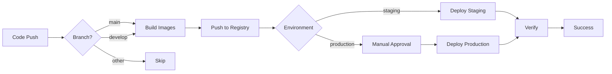

# GitLab CI/CD Setup Guide for GKE

This comprehensive guide walks you through setting up GitLab CI/CD pipelines to automatically build, push, and deploy your Flask K8s application to GKE.

## Table of Contents

1. [Overview](#overview)
2. [Prerequisites](#prerequisites)
3. [GCP Service Account Setup](#gcp-service-account-setup)
4. [GitLab CI/CD Variables](#gitlab-cicd-variables)
5. [GitLab Runner Configuration](#gitlab-runner-configuration)
6. [Pipeline Configuration](#pipeline-configuration)
7. [Multi-Environment Setup](#multi-environment-setup)
8. [Testing the Pipeline](#testing-the-pipeline)
9. [Advanced Features](#advanced-features)
10. [Troubleshooting](#troubleshooting)

---

## Overview

### What Gets Automated

The GitLab CI/CD pipeline will automatically:

1. **Build** Docker images for backend and frontend
2. **Push** images to Google Artifact Registry
3. **Deploy** to GKE cluster
4. **Verify** deployment success
5. **Rollback** on failure (optional)

### Pipeline Stages

```
┌─────────┐     ┌──────────┐     ┌──────────┐     ┌────────────┐
│  Build  │────▶│   Push   │────▶│  Deploy  │────▶│   Verify   │
└─────────┘     └──────────┘     └──────────┘     └────────────┘
```

### When Pipeline Runs

- **Automatic**: On push to `main` or `develop` branches
- **Manual**: Via GitLab UI (Run Pipeline button)
- **Scheduled**: Set up cron-based deployments (optional)

---

## Prerequisites

Ensure you have:

- ✅ GitLab account (gitlab.com or self-hosted)
- ✅ GKE cluster running (from [GKE Setup](./GKE-SETUP.md))
- ✅ Artifact Registry configured (from [Artifact Registry Setup](./ARTIFACT-REGISTRY-SETUP.md))
- ✅ Project code in a GitLab repository
- ✅ kubectl access to GKE cluster from local machine

---

## GCP Service Account Setup

Create a service account for GitLab CI/CD with appropriate permissions.

### Step 1: Create Service Account

```bash
# Set variables
export GCP_PROJECT_ID="flask-k8s-production"
export SA_NAME="gitlab-deployer"
export SA_DISPLAY_NAME="GitLab CI/CD Deployer"

# Create service account
gcloud iam service-accounts create $SA_NAME \
  --display-name="$SA_DISPLAY_NAME" \
  --description="Service account for GitLab CI/CD pipelines" \
  --project=$GCP_PROJECT_ID

# Verify creation
gcloud iam service-accounts list --project=$GCP_PROJECT_ID | grep $SA_NAME
```

### Step 2: Grant Required Permissions

The service account needs permissions for:
- Artifact Registry (push images)
- GKE (deploy applications)
- Storage (optional, for state/logs)

```bash
# Get service account email
export SA_EMAIL="${SA_NAME}@${GCP_PROJECT_ID}.iam.gserviceaccount.com"

# Grant Artifact Registry Writer (push images)
gcloud projects add-iam-policy-binding $GCP_PROJECT_ID \
  --member="serviceAccount:$SA_EMAIL" \
  --role="roles/artifactregistry.writer"

# Grant GKE Developer (deploy to cluster)
gcloud projects add-iam-policy-binding $GCP_PROJECT_ID \
  --member="serviceAccount:$SA_EMAIL" \
  --role="roles/container.developer"

# Grant Storage Admin (optional - for build cache)
gcloud projects add-iam-policy-binding $GCP_PROJECT_ID \
  --member="serviceAccount:$SA_EMAIL" \
  --role="roles/storage.admin"

# Verify permissions
gcloud projects get-iam-policy $GCP_PROJECT_ID \
  --flatten="bindings[].members" \
  --filter="bindings.members:serviceAccount:$SA_EMAIL"
```

### Step 3: Create and Download Service Account Key

```bash
# Create key file
gcloud iam service-accounts keys create ~/gitlab-deployer-key.json \
  --iam-account=$SA_EMAIL \
  --project=$GCP_PROJECT_ID

# Verify key was created
ls -lh ~/gitlab-deployer-key.json

# Display key content (you'll add this to GitLab)
cat ~/gitlab-deployer-key.json
```

> [!CAUTION]
> **SECURITY CRITICAL**: This JSON key grants full access!
> - Never commit to Git
> - Store only in GitLab CI/CD variables (masked & protected)
> - Delete the local file after adding to GitLab
> - Rotate keys every 90 days

### Step 4: Base64 Encode the Key

GitLab CI/CD variables work better with base64-encoded values:

```bash
# Encode the key
cat ~/gitlab-deployer-key.json | base64 > ~/gitlab-deployer-key-base64.txt

# Display encoded key (copy this value)
cat ~/gitlab-deployer-key-base64.txt

# On macOS, copy to clipboard
cat ~/gitlab-deployer-key-base64.txt | pbcopy
```

### Step 5: Secure the Key

```bash
# After adding to GitLab, delete local copies
rm ~/gitlab-deployer-key.json
rm ~/gitlab-deployer-key-base64.txt

# Verify deletion
ls -la ~ | grep gitlab-deployer
```

---

## GitLab CI/CD Variables

Add secrets and configuration to your GitLab project.

### Step 1: Navigate to CI/CD Settings

1. Go to your GitLab project
2. **Settings** → **CI/CD**
3. Expand **Variables** section
4. Click **Add variable**

### Step 2: Add Required Variables

Add the following variables:

#### GCP_SERVICE_KEY (Required)

- **Key**: `GCP_SERVICE_KEY`
- **Value**: Paste the base64-encoded service account key
- **Type**: Variable
- **Protected**: ✅ Yes (only available on protected branches)
- **Masked**: ✅ Yes (hidden in logs)
- **Expand variable reference**: ❌ No

#### GCP_PROJECT_ID (Required)

- **Key**: `GCP_PROJECT_ID`
- **Value**: `flask-k8s-production` (your GCP project ID)
- **Type**: Variable
- **Protected**: ❌ No
- **Masked**: ❌ No

#### GCP_REGION (Required)

- **Key**: `GCP_REGION`
- **Value**: `us-central1` (your GCP region)
- **Type**: Variable
- **Protected**: ❌ No
- **Masked**: ❌ No

#### GCP_ZONE (Required)

- **Key**: `GCP_ZONE`
- **Value**: `us-central1-a` (your GCP zone)
- **Type**: Variable
- **Protected**: ❌ No
- **Masked**: ❌ No

#### ARTIFACT_REGISTRY_REPO (Required)

- **Key**: `ARTIFACT_REGISTRY_REPO`
- **Value**: `flask-app-images`
- **Type**: Variable
- **Protected**: ❌ No
- **Masked**: ❌ No

#### GKE_CLUSTER_NAME (Required)

- **Key**: `GKE_CLUSTER_NAME`
- **Value**: `flask-k8s-cluster`
- **Type**: Variable
- **Protected**: ❌ No
- **Masked**: ❌ No

#### KUBE_NAMESPACE (Optional)

- **Key**: `KUBE_NAMESPACE`
- **Value**: `flask-app`
- **Type**: Variable
- **Protected**: ❌ No
- **Masked**: ❌ No

### Summary of Variables

| Variable | Value | Protected | Masked |
|----------|-------|-----------|--------|
| `GCP_SERVICE_KEY` | Base64 service account key | ✅ | ✅ |
| `GCP_PROJECT_ID` | `flask-k8s-production` | ❌ | ❌ |
| `GCP_REGION` | `us-central1` | ❌ | ❌ |
| `GCP_ZONE` | `us-central1-a` | ❌ | ❌ |
| `ARTIFACT_REGISTRY_REPO` | `flask-app-images` | ❌ | ❌ |
| `GKE_CLUSTER_NAME` | `flask-k8s-cluster` | ❌ | ❌ |
| `KUBE_NAMESPACE` | `flask-app` | ❌ | ❌ |

---

## GitLab Runner Configuration

You can use GitLab's shared runners or set up your own.

### Option 1: Use GitLab Shared Runners (Easiest)

GitLab.com provides free shared runners:

1. Go to **Settings** → **CI/CD** → **Runners**
2. Expand **Runners** section
3. Enable **Shared runners** (usually enabled by default)
4. Verify you see available shared runners

**Pros:**
- No setup required
- Free tier available (2,000 CI/CD minutes/month on free plan)
- Auto-scaling

**Cons:**
- Limited minutes on free tier
- Shared resources (can be slower)

### Option 2: Set Up Your Own GitLab Runner

For unlimited minutes and better control:

#### Install GitLab Runner (macOS)

```bash
# Install using Homebrew
brew install gitlab-runner

# Verify installation
gitlab-runner --version
```

#### Install GitLab Runner (Linux)

```bash
# Add GitLab's official repository
curl -L "https://packages.gitlab.com/install/repositories/runner/gitlab-runner/script.deb.sh" | sudo bash

# Install
sudo apt-get install gitlab-runner

# Verify
gitlab-runner --version
```

#### Register Runner

```bash
# Get registration token from GitLab:
# Settings → CI/CD → Runners → Expand → Registration token

# Register runner
gitlab-runner register

# Follow prompts:
# 1. GitLab instance URL: https://gitlab.com (or your GitLab URL)
# 2. Registration token: [paste token from GitLab]
# 3. Description: my-gitlab-runner
# 4. Tags: docker,gke,deployment
# 5. Executor: docker
# 6. Default Docker image: google/cloud-sdk:latest
```

#### Configure Runner for Docker-in-Docker

Edit `/etc/gitlab-runner/config.toml`:

```toml
[[runners]]
  name = "my-gitlab-runner"
  url = "https://gitlab.com"
  token = "YOUR_TOKEN"
  executor = "docker"
  [runners.docker]
    image = "google/cloud-sdk:latest"
    privileged = true
    volumes = ["/var/run/docker.sock:/var/run/docker.sock", "/cache"]
```

Start the runner:

```bash
gitlab-runner start
```

---

## Pipeline Configuration

The `.gitlab-ci.yml` file is already created in your project root. Let's understand it.

### Pipeline Structure

```yaml
stages:
  - build
  - push  
  - deploy
  - verify
```

### Key Features

1. **Multi-stage builds**: Separate build, push, and deploy stages
2. **Image caching**: Reuse Docker layers for faster builds
3. **Parallel jobs**: Build backend and frontend simultaneously
4. **Auto-tagging**: Uses Git commit SHA for versioning
5. **Environment-specific**: Deploy to staging or production
6. **Manual gates**: Optional manual approval before production

### Pipeline Flow



### Understanding the .gitlab-ci.yml

See the actual file at `.gitlab-ci.yml` (created separately).

Key sections:

**Variables:**
```yaml
variables:
  DOCKER_DRIVER: overlay2
  DOCKER_TLS_CERTDIR: ""
  IMAGE_TAG: ${CI_COMMIT_SHORT_SHA}
```

**Build stage:**
- Builds Docker images
- Tags with commit SHA
- Runs in parallel for backend/frontend

**Push stage:**
- Authenticates to GCP
- Pushes images to Artifact Registry
- Tags as `latest` and commit SHA

**Deploy stage:**
- Gets GKE credentials
- Updates Kubernetes manifests
- Applies changes
- Waits for rollout

**Verify stage:**
- Checks pod status
- Verifies endpoints
- Runs health checks

---

## Multi-Environment Setup

Deploy to staging and production environments.

### Step 1: Configure Environments in GitLab

1. **Settings** → **CI/CD** → **Environments**
2. Create two environments:
   - **staging** (auto-deploy from `develop` branch)
   - **production** (manual deploy from `main` branch)

### Step 2: Create Environment-Specific K8s Manifests

```bash
# Create environment directories
mkdir -p k8s/gke/staging
mkdir -p k8s/gke/production

# Copy manifests
cp k8s/gke/*.yaml k8s/gke/staging/
cp k8s/gke/*.yaml k8s/gke/production/

# Edit for environment-specific configs
# - Different ingress hostnames
# - Different replica counts
# - Different resource limits
```

### Step 3: Update Pipeline for Environments

The `.gitlab-ci.yml` already includes environment support:

```yaml
deploy:staging:
  stage: deploy
  environment:
    name: staging
    url: https://staging.flask-app.example.com
  only:
    - develop

deploy:production:
  stage: deploy
  environment:
    name: production
    url: https://flask-app.example.com
  when: manual  # Requires manual approval
  only:
    - main
```

---

## Testing the Pipeline

### Step 1: Make a Test Change

```bash
# Make a small change
echo "# Test CI/CD" >> README.md

# Commit and push
git add README.md
git commit -m "Test GitLab CI/CD pipeline"
git push origin main
```

### Step 2: Monitor Pipeline

1. Go to **CI/CD** → **Pipelines**
2. Click on the running pipeline
3. Watch each stage execute

Expected stages:
- ✅ Build (2-5 minutes)
- ✅ Push (1-2 minutes)
- ⏸️ Deploy (manual approval)
- ⏳ Verify (after deploy)

### Step 3: Check Logs

Click on each job to see logs:
- Build logs show Docker build output
- Push logs show image uploads
- Deploy logs show kubectl apply
- Verify logs show pod status

### Step 4: Manual Deployment (Production)

For production deployment:
1. Click the deploy job
2. Click **Play** button (▶️)
3. Pipeline continues to deploy

---

## Advanced Features

### Feature 1: Build Cache

Speed up builds with Docker layer caching:

```yaml
build:backend:
  cache:
    key: ${CI_COMMIT_REF_SLUG}
    paths:
      - backend/.buildcache
```

### Feature 2: Parallel Testing

Add a test stage:

```yaml
test:backend:
  stage: test
  image: python:3.11-slim
  before_script:
    - cd backend
    - pip install -r requirements.txt
  script:
    - pytest tests/
```

### Feature 3: Rollback on Failure

Automatic rollback if deployment fails:

```yaml
deploy:production:
  script:
    - kubectl apply -f k8s/gke/production/ || kubectl rollout undo deployment/backend-deployment -n flask-app
```

### Feature 4: Slack/Email Notifications

Add notifications on pipeline status:

```yaml
notify:success:
  stage: notify
  script:
    - echo "Deployment successful!"
    - 'curl -X POST -H "Content-type: application/json" --data "{\"text\":\"✅ Deployment successful!\"}" $SLACK_WEBHOOK_URL'
  only:
    - main
  when: on_success
```

### Feature 5: Scheduled Pipelines

Set up cron-based deployments:

1. **CI/CD** → **Schedules**
2. Click **New schedule**
3. Set cron: `0 2 * * *` (2 AM daily)
4. Target branch: `main`
5. Variables: `DEPLOY_ENV=production`

---

## Troubleshooting

### Issue: Pipeline fails at authentication

```yaml
# Error: "Failed to activate service account"

# Solution: Verify GCP_SERVICE_KEY is correctly base64 encoded
# Test locally:
echo $GCP_SERVICE_KEY | base64 -d | jq .
```

### Issue: Docker build fails

```yaml
# Error: "Cannot connect to Docker daemon"

# Solution: Ensure runner has Docker-in-Docker enabled
# Check config.toml:
privileged = true
```

### Issue: Image push fails

```bash
# Error: "denied: Permission denied"

# Solution: Check service account permissions
gcloud projects get-iam-policy $GCP_PROJECT_ID \
  --flatten="bindings[].members" \
  --filter="bindings.members:serviceAccount:$SA_EMAIL"
```

### Issue: kubectl cannot connect

```bash
# Error: "Unable to connect to the server"

# Solution: Verify GKE cluster name and zone
gcloud container clusters list
```

### Issue: Deployment times out

```yaml
# Error: "error: timed out waiting for the condition"

# Solution: Increase timeout or check pod status
kubectl get pods -n flask-app
kubectl describe pod <pod-name> -n flask-app
```

---

## Best Practices

### 1. Use Protected Branches

- Protect `main` and `develop` branches
- Require merge requests for changes
- Run pipelines only on protected branches

### 2. Semantic Versioning

```bash
# Tag releases
git tag -a v1.0.0 -m "Release version 1.0.0"
git push origin v1.0.0

# Update pipeline to use tags
IMAGE_TAG: ${CI_COMMIT_TAG:-${CI_COMMIT_SHORT_SHA}}
```

### 3. Resource Limits

Set pipeline resource limits:

```yaml
variables:
  KUBERNETES_CPU_REQUEST: "100m"
  KUBERNETES_MEMORY_REQUEST: "128Mi"
  KUBERNETES_CPU_LIMIT: "1"
  KUBERNETES_MEMORY_LIMIT: "512Mi"
```

### 4. Pipeline Optimization

- Use smaller Docker images (alpine)
- Limit number of layers in Dockerfile
- Use build cache effectively
- Run tests in parallel

### 5. Security Scanning

Add vulnerability scanning:

```yaml
security:scan:
  stage: test
  image: aquasec/trivy:latest
  script:
    - trivy image $CI_REGISTRY_IMAGE:$CI_COMMIT_SHORT_SHA
```

---

## Pipeline Dashboard

Monitor your pipelines:

1. **Project Overview** → Shows latest pipeline status
2. **CI/CD** → **Pipelines** → All pipeline runs
3. **CI/CD** → **Jobs** → Individual job logs
4. **Deployments** → **Environments** → Environment history

---

## Cost Optimization

### GitLab CI/CD Minutes

Free tier limits:
- **Free**: 400 CI/CD minutes/month
- **Premium**: 10,000 CI/CD minutes/month
- **Ultimate**: 50,000 CI/CD minutes/month

**Optimize minutes:**
1. Use specific runners for long jobs
2. Cache dependencies
3. Use smaller Docker images
4. Run only necessary jobs

### GCP Costs

Pipeline incurs GCP costs:
- **Artifact Registry**: $0.10/GB/month storage
- **Network**: Data transfer charges
- **Compute**: Minimal (kubectl operations)

**Estimated cost**: $2-5/month for small project

---

## Next Steps

✅ **GitLab CI/CD is now configured!**

Continue with:

1. **[Monitoring Setup](./GKE-TROUBLESHOOTING.md)** - Set up alerts and logging
2. **[Production Checklist](./GKE-PRODUCTION-CHECKLIST.md)** - Harden for production
3. **Make your first deployment!**

---

## Additional Resources

- [GitLab CI/CD Documentation](https://docs.gitlab.com/ee/ci/)
- [GitLab CI/CD Examples](https://docs.gitlab.com/ee/ci/examples/)
- [Docker-in-Docker](https://docs.gitlab.com/ee/ci/docker/using_docker_build.html)
- [GKE with GitLab](https://docs.gitlab.com/ee/user/project/clusters/add_gke_clusters.html)

---

**Next Guide**: [Troubleshooting Guide →](./GKE-TROUBLESHOOTING.md)
